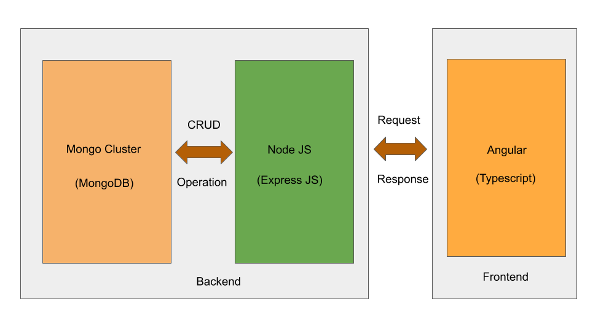
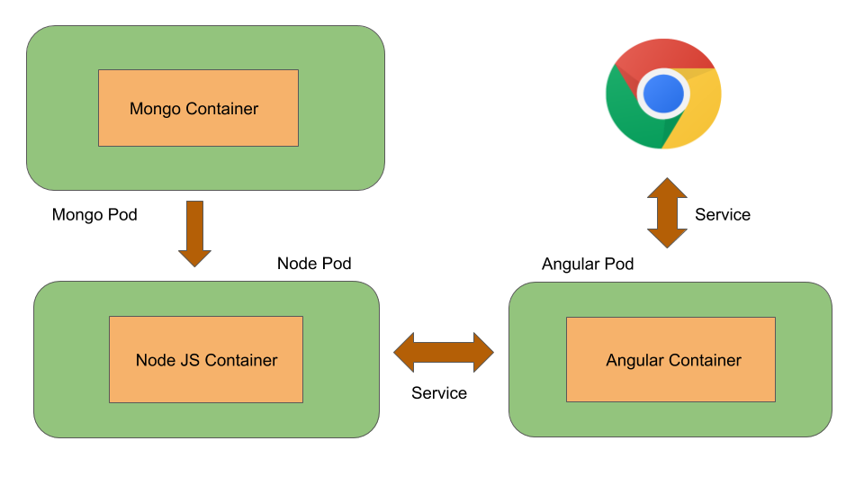

# ToDo 

ToDo is a Web Application used to manage tasks to be done.The goals of developing 
this application are:
1. To gain experience in **Full-Stack Development** 
2. To acquire **Docker** and **Kubernetes** skills

## Technology Stack




## Deployment
### Docker
Build docker images:
Picture for Frontend and Backend
```python
$ cd deploy/docker
$ docker build -f Dockerfile-frontend -t abinavram/todoappangular .
$ docker build -f Dockerfile-backend -t abinavram/todoappnode .
```
"abinavram/todoappangular" is the image tag for Frontend
"abinavram/todoappnode" is the image tag for Backend

Run the Docker images:
```python
$ docker run -p 4200:4200 abinavram/todoappangular
$ docker run -p 8080:8080 abinavram/todoappnode
```
Port number 4200 is the port exposed by the frontend container so that the app can be accessed outside the container and viewed in a browser.

Push the image to Docker hub
```python
$ docker push abinavram/todoappangular
$ docker push abinavram/todoappnode
```
To verify you may visit Docker hub and verify the images.
### docker-compose
`docker-compose` , a single command will brings up multiple containers.
```python
$ docker-compose up
```
Above command will bring up three containers : 
- abinavram/todoappangular
- abinavram/todoappnode 
- mongo.
Picture for Representation three images
### Kubernetes


Start the minikube in local Machine
```python
$ minikube start
$ cd deploy/minikube
```
Create a deployment in Minikube 
```python
$ kubectl create -f angular.yaml
  deployment.apps/angular-deployment created
  service/angular-service created
$ kubectl create -f node-deployment.yaml
  deployment.apps/node created
$ kubectl create -f node-service.yaml
  service/node created
$ kubectl create -f mongo-deployment.yaml
  deployment.apps/mongo created
$ kubectl create -f mongo-service.yaml
  service/mongo created
```
To verify that pods and services are created:
```python
$ kubectl get pods
  NAME                                  READY   STATUS    RESTARTS   AGE
  angular-deployment-776f886685-7ppp6   1/1     Running   3          5d21h
  mongo-d9cf4754b-zf46w                 1/1     Running   9          6d14h
  node-645876894f-td86r                 1/1     Running   10         6d12h
$ kubectl get services
  NAME              TYPE           CLUSTER-IP       EXTERNAL-IP     PORT(S)          AGE
  angular-service   LoadBalancer   10.100.238.27    10.100.238.27   4200:30781/TCP   5d21h
  kubernetes        ClusterIP      10.96.0.1        <none>          443/TCP          6d16h
  mongo             ClusterIP      10.111.148.221   <none>          27017/TCP        6d14h
  node              LoadBalancer   10.100.71.34     10.100.71.34    8080:30266/TCP   6d14h
```
Note that the names of services created are: 
mongo-service, node-service and angular-service.  To view the application in browser:
```python
$ minikube service angular-service
```

### Deploy the application in Heroku Cloud

Build the Angular project using Angular CLI: 
```python
$ ng build --prod
Generating ES5 bundles for differential loading...
ES5 bundle generation complete.

chunk {0} runtime-es2015.0dae8cbc97194c7caed4.js (runtime) 1.45 kB [entry] [rendered]
chunk {0} runtime-es5.0dae8cbc97194c7caed4.js (runtime) 1.45 kB [entry] [rendered]
chunk {2} polyfills-es2015.f332a089ad1600448873.js (polyfills) 36.1 kB [initial] [rendered]
chunk {3} polyfills-es5.177e85a9724683782539.js (polyfills-es5) 129 kB [initial] [rendered]
chunk {1} main-es2015.cb907541ee775e80933f.js (main) 345 kB [initial] [rendered]
chunk {1} main-es5.cb907541ee775e80933f.js (main) 415 kB [initial] [rendered]
chunk {4} styles.2935066d9c3bef3ac975.css (styles) 204 kB [initial] [rendered]
Date: 2020-08-31T14:55:13.259Z - Hash: e45636d1e1daf4a0e969 - Time: 120713ms
```
Above command will build the entire project in dist/project-name folder.  For deploying application in heroku App, Run the dist/project-name folder.  The below steps will run the application (dist/project-name)  in Heroku Cloud:

1. Create a server.js file
2.Add the below line in server.js file :
```python
app.use(express.static(path.join(__dirname,'/../dist/project-name')));
```
3. Create a Procfile (specifies the command that are executed by the app on startup) and Add the below line to run the JS file:
```python
web: node Backend/server.js
```
where,
```python
web : Process type to which Heroku listen and receives the request. web command will be executed for running ToDo application.
```
Here it is ,ToDo App URL : 
[https://sheltered-shore-92400.herokuapp.com](https://sheltered-shore-92400.herokuapp.com/)
