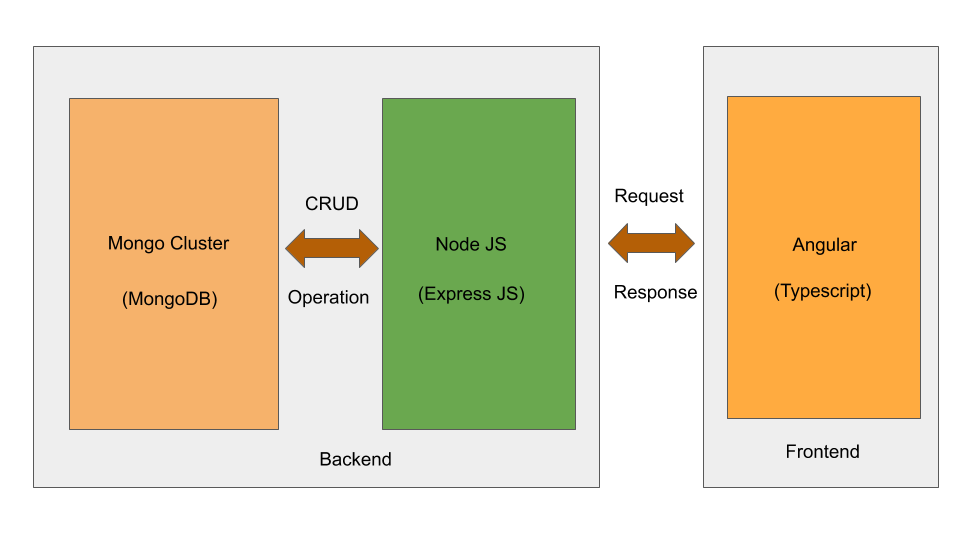

# ToDo

ToDo is a Web Application used to monitor the task to be done.

## Technology Stack




## Deployment
### Docker
Build a couple of  Docker image:
Picture for Frontend and Backend
```python
$ cd Deploy/Docker
```
Build the image for Frontend
```python
$ docker build -f Dockerfile-frontend -t abinavram/todoappangular .

$ docker build -f Dockerfile-backend -t abinavram/todoappnode .
```
"abinavram/todoappangular" - Image tag for Frontend
"abinavram/todoappangular" - Image tag for Backend

Run the Docker image using Container:
Need to specify the port to access the app outside the container and view in Browser
```python
$ docker run -p 4200:4200 abinavram/todoappangular
$ docker run -p 8080:8080 abinavram/todoappnode
```
Push the image to Docker Hub
```python
$ docker push abinavram/todoappangular
$ docker push abinavram/todoappnode
```
Successfully build the two images for both frontend and Backend and Uploaded to the Docker Hub :)
### Docker-Compose
Docker - Compose will run the multiple images in a multiple container . So that Containers can be accessable.
```python
$ docker-compose up
```
Above command will run three images : abinavram/todoappangular, abinavram/todoappnode and mongo.
Picture for Representation three images
### Kubernetes
Picture for Frontend and Backend

Start the minikube in Local Machine
```python
$ minikube start
$ cd Deploy/Minikube
```
Create a Deployment in Minikube 
```python
$ kubectl create -f angular.yaml
  deployment.apps/angular-deployment created
$ kubectl create -f node-deploment.yaml
  deployment.apps/node created
$ kubectl create -f node-service.yaml
  service/node created
$ kubectl create -f mongo-deployment.yaml
  deployment.apps/mongo created
$ kubectl create -f mongo-service.yaml
  service/mongo created
```
Check the Pods and Services are created
```python
$ kubectl get pods
  NAME                                  READY   STATUS    RESTARTS   AGE
  angular-deployment-776f886685-7ppp6   1/1     Running   3          5d21h
  mongo-d9cf4754b-zf46w                 1/1     Running   9          6d14h
  node-645876894f-td86r                 1/1     Running   10         6d12h
$ kubectl get services
  NAME              TYPE           CLUSTER-IP       EXTERNAL-IP     PORT(S)          AGE
  angular-service   LoadBalancer   10.100.238.27    10.100.238.27   4200:30781/TCP   5d21h
  kubernetes        ClusterIP      10.96.0.1        <none>          443/TCP          6d16h
  mongo             ClusterIP      10.111.148.221   <none>          27017/TCP        6d14h
  node              LoadBalancer   10.100.71.34     10.100.71.34    8080:30266/TCP   6d14h
```
Successfully created Services Pods and Deployment,
Name of Service created: 
mongo-service , node-service and angular-service.
```python
$ minikube service angular-service
```
You can able to view the application in Browser.
